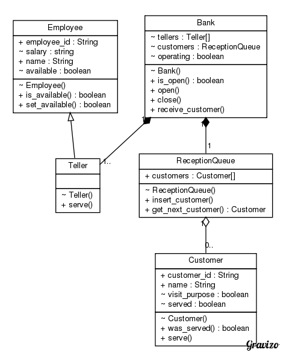
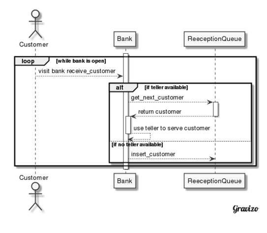

# Programming Methodology II | Project 1
Joshua Chan | 1490009699 | jpc256

[](https://circleci.com/gh/joshpaulchan/banksim)

# Get Started

## Installation

```bash
$ pip install -r requirements.txt
```

## Running the project

```bash
# first you need to load the virtual environment into the shell
$ source venv/bin/activate
# then you can run the program
$ python main.py 100 -t 1
# once you're done running it, exit the virtual environment
$ deactivate
```

The first number, `100` indicates the amount of customers that will visit in
this simulation. The option `-t` is the number of tellers.

```bash
$ python main.py 100 -t 1
```

## Testing the project

```bash
# first you need to load the virtual environment into the shell
$ source venv/bin/activate
# then you can run the program
$ pytest -v
# once you're done running it, exit the virtual environment
$ deactivate
```

Additionally, builds are tested automatically using CircleCI. Check the badge at
the top of this document for the most recent build status.

# Assignment

## I. Formulate and transcribe problem and use case(s).

The prompt is: "We discussed the decision faced by a Bank Manager on whether to
hire additional teller(s) to supplement the existing single teller, so as to
provide better service to customers (she wants to know how better the service
will be given the additional cost):"

What this is really saying is:
1. Build a system that simulates in-person bank teller(s) and account holder(s)
(customers) interactions.
1. Measure the effectiveness of varying the number of tellers with respect to
different loads of customers.

> A system like this is useful because the client (the Bank Manager) can use this
system to gain critical insight into potential customer scenarios and use that
insight to make key staffing decisions.

To build such a system, we will need to do a few things, mainly:

* Define the capabilities of a teller
* Define the scenarios/interactions a customer might produce
* Define a "reception orders" that determines when which customers will be
  served

For our simulation, we will be assuming:

* The simulation runs in a discrete fashion
  - Customers enter at discrete time steps
  - It takes unit time steps to serve a customer, regardless of purpose and
  teller capability
  - The simulation on runs until all the customers in the queue have been served
  (after the first "wave" the bank closes)
* Customers come in in a constant, even rate - similar to a square wave.


I designed a few Actor/Participant classes to encapsulate and objectify the
operators in the scenarios (Customers, Tellers, and ReceptionQueue), as well as
a container class to run the entire simulation (Bank).



I chose to make `Teller` an sub-class of a virtual `Employee` so that in the
future we have the flexibility to introduce different kinds of service-men to
the Bank. I also gave it a salary and a few other non-relevant attributes for
system book-keeping purposes and the ability to run possible finanical
simulations at a later time.

I made ReceptionQueue to model a real line/queue's FIFO behavior, but it is also
trivial to modify the class so that the insertion behavior can be changed such
that the queue implements other behaviors like LIFO or else.

Because we made the choice to go discrete, I chose to simplify the functionality
of the Bank by making its operations synchronous, rather than worry about
possible issues with Pub-Sub/Asynchronous models that may lead to timing issues
and difficulty in modeling. Thus, the main flow essentially resembles this:



## II. Implement a simulation that will mimic the arrival of customers, service by the Teller and successful departure of a customer.

See code.

# III. Assume 10 customers arrive every minute for 10 minutes. Assume each service
time is of duration 1 unit. What is the average wait time for the 100 customers
when there is (1) 1 Teller, (ii) 2 Tellers, (iii) 10 Tellers?

* <strong>1 teller</strong> has 100 customers waiting an average of <strong>45.0 seconds</strong>
* <strong>2 tellers</strong> has 100 customers waiting an average of <strong>20.0 seconds</strong>
* <strong>10 tellers</strong> has 100 customers waiting an average of <strong>0 seconds</strong>

# IV. Design and implement unit tests, integration, system and acceptance tests for your project.

See `tests/`
